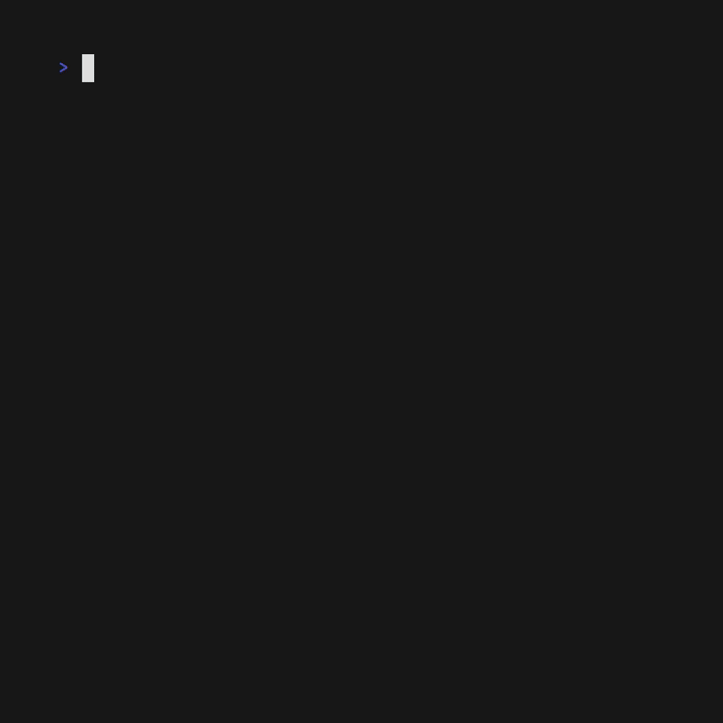

# Turnip
Turnip is a Turing machine sim for the terminal. Programs can be written for
the simulator in the Turnip language.


## Programming Turnip

### Setting up the Simulation
A `.turnip` file starts with a grid representing the initial state of the sim.
A grid is made up of only `0`s `1`s and `.`s (representing a blank cell).
e.g.
```
......
.0101.
.1100.
......
```
That is followed by the start state and start coordinates in the form 
`state(x, y)`. Coordinates on the grid start with (0,0) in the top left, which 
will be familiar if you have worked with screen coordinates. i.e.
```
 012 x
0...
1...
2...
y
```

### Defining States
The logic for each state comes last. To explain this we will work through a 
simple demo machine that simply goes right flipping every `0` to a `1` and every
`1` to a `0`, stopping when it sees a `.`.
```
flipper {0 1>flipper|1 0>flipper|. _}
```
`flipper` is the name of this state. Inside `{}` we have the responses to each 
possible output, `0`, `1` or `.`, separated by `|`. Let's break down the first
response `0 1>flipper`. We start with the input `0`, then the actions, `1` (to 
write a `1`), and `>` (to shift right once). Then we end with `flipper`, the 
new state of the machine.

In the third response there are no actions and we end on the state `_`, which
represents the HALT state.


